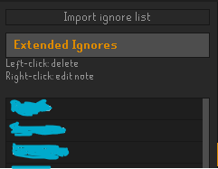

# Extended Ignore List

Extended Ignore List expands RuneScape's native ignore system by maintaining an additional plugin-managed ignore list, so you can track and filter more players than the in-game limit.

## What it does

- Extends ignore capacity beyond the native cap by storing extra ignored names in plugin config.
- Imports your current native ignore list into the extended list with one click. Imports and individual additions follow the selected sort order.
- Offers a remembered panel dropdown for `Name A-Z`, `Name Z-A`, `Oldest first`, and `Newest first` (default). New entries appear alphabetically in name modes, at the bottom in oldest-first mode, or at the top in newest-first mode.
- Quietly saves each entry's date added; dates are not shown in the panel. Editing notes, tracking a rename, or adding an already-tracked entry does not reset its date. Removing and re-adding an entry gives it a new date.
- Preserves the existing list's relative newest-to-oldest order when migrating entries without dates. These assigned migration timestamps are not their actual historical addition dates. New entries in a bulk import follow the native legacy addition order regardless of either list's selected sort: newest-first mode shows the newest native entry first, and oldest-first mode reverses that batch. Importing does not change the native sort or existing extended entries' saved dates; native entries do not expose actual historical addition dates.
- Mirrors native ignore actions:
	- `Add ignore` player menu action syncs into extended list.
	- Native `Add Name` attempts are captured and synced, including fallback when native add fails (for example, native list is full).
	- Native `Del Name` / remove-ignore sync can remove from extended list when `Sync Remove ignore` is enabled.
- Supports adding names from the native ignore-list context menu with `Add to extended`.
- Supports left-click row deletion and right-click note editing in the extended list.
- Deleting a row only removes it from the extended list, not your native ignore list. Native add tracking does not automatically restore deleted rows; explicitly importing the native list or adding that player again can restore them.
- Stores notes independently in the extended list, with note indicators and saved-note tooltips.
- `Add to extended` and `Import ignore list` copy available Friend Notes from the active RuneLite configuration profile into empty extended-list notes. Current-name notes take priority, with previous names and tracked aliases as fallbacks. Existing extended notes are never overwritten and Friend Notes are never changed. This is a one-time copy, not ongoing synchronization; the import button also allows filling missing notes on already-tracked native entries.
- Developer-mode clients show a `Clear extended list (dev)` button directly below `Import ignore list`. It always asks for confirmation and permanently clears all shared extended entries, aliases, notes, and dates added, including the copy synced to other computers. Native ignores, Friend Notes, and feature settings remain unchanged. Normal clients do not show this button.

## Identity and syncing behavior

- Tracks rename history using aliases and native ignore current/previous names, so ignored players stay matched after name changes.
- Shares the extended list, aliases, notes, and dates added across RuneScape accounts AND RuneLite configuration profiles. Feature settings (including the panel sort selection) remain configuration-profile-specific.
- To share across computers, use the updated plugin and sign into the same RuneLite account on every computer. Entries use a fixed plugin namespace in RuneLite's automatically synced shared store; the selected configuration profiles do not need to match.
- Uses RuneLite's normal cloud sync timing, not instant live synchronization. Allow the source client to sync (or close it normally), then restart the other client to receive changes. Avoid editing the list on both computers at once: the list is stored as one setting, so competing edits can overwrite each other.
- Automatically merges existing account-specific extended lists and the active configuration profile's old list into the shared store. Switch through other configuration profiles once to migrate their old lists too. Matching names/aliases are combined; distinct notes are joined with ` / `. Migrated entries are removed from their old storage so deleted shared entries are not re-imported later.
- Reloads when RuneLite sessions, configuration profiles, or the shared list setting change. Import still reads only the currently logged-in RuneScape account's native ignore list; it does not change another account's native list.

## Optional filtering features

- Hide ignored players from rendering in-scene.
- Suppress chat visibility checks for ignored names.
- Hide incoming trade request messages from ignored players.
- Show extended-ignored players' names in red on Chambers of Xeric, Theatre of Blood, and Tombs of Amascut party boards, member lists, and applicant lists, plus Barbarian Assault current-team lists and recruitment scrolls. `Highlight Raids/Groups` is enabled by default and can be turned off in the plugin settings.
- Raid-board highlighting matches whole names, including tracked aliases, rather than parts of other players' names. It updates each game tick while a supported list is open and restores the original text when an entry is removed, the feature is disabled, or the plugin is stopped. It does not replace names, change party actions, or alter your native ignore list.
- `Notify when in group` offers `Notification + chat`, `Chat only` (default), or `None`. Warns when an extended-ignored player or tracked alias is in your own raid group or Barbarian Assault team, whether they join you or you join them. RuneLite notifications follow your RuneLite notification settings.
- Group warnings use the actual ToB/ToA party slots, not the party board you are browsing or pending applicants. CoX warnings use your own raid sidepanel's full-name roster once you enter the Chambers. A warning is sent once per ignored player's presence, not every tick; leaving and rejoining can trigger another warning. Turning notifications on while already grouped also checks the current roster. Board highlighting and group warnings work independently.
- Barbarian Assault warnings use the current-team overlay in the recruitment rooms, not unaccepted recruitment scrolls. Warning state is retained while that roster is unavailable between waves; visible team changes, leaving BA, or logout reset it. Censoring and single-player notes apply to BA warnings too.
- `Censor name`, directly below `Notify when in group`, is off by default. When enabled, group alerts say `Someone is on your extended ignore list.` or `Some people are on your extended ignore list.` instead of listing names. This applies to both chat messages and notifications, not raid-board highlighting.
- When exactly one ignored player is detected in your raid group and they have a note, the chat alert includes `for {note}.` (also when names are censored). RuneLite notifications do not include notes, and notes are omitted when multiple ignored players are present.
